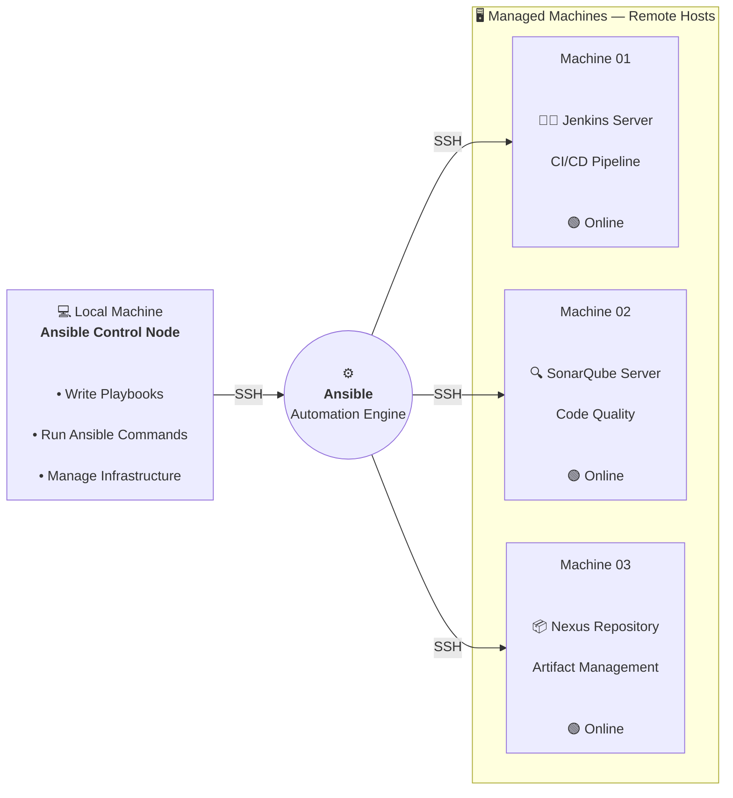

# DevOps Infrastructure as Code (IaC) — Ansible Automation

This project provides an **Infrastructure as Code (IaC)** solution for provisioning, configuring, and destroying a DevOps infrastructure environment using **Ansible** and **Docker**.

The goal is to automate the setup of commonly used DevOps tools so that the infrastructure can be recreated consistently without manually configuring each server.

---

## 📌 Overview

The infrastructure includes:

- Jenkins — CI/CD automation
- Nexus — Artifact and package repository
- SonarQube — Code quality and static analysis
- Portainer — Docker management UI
- Caddy — Reverse proxy and HTTPS
- Docker — Container runtime
- Common CLI tools and development utilities

Ansible is responsible for provisioning and configuring the machines, while Docker is used to run the application services.


## 🏗️ Architecture Illustration



# 🎯 Project Objectives

This project is designed to achieve the following:

- Automate server provisioning with Ansible
- Install and configure Docker
- Deploy Jenkins using Docker
- Deploy Nexus using Docker
- Deploy SonarQube using Docker
- Deploy Portainer
- Configure a reverse proxy
- Configure HTTPS for DevOps services
- Install common development tools
- Provide a repeatable infrastructure setup
- Provide a playbook to destroy/reset the environment
- Reduce manual server configuration

---

# 🛠️ Technologies

| Technology | Purpose |
|---|---|
| Ansible | Infrastructure automation |
| Docker | Container runtime |
| Docker Compose | Container orchestration |
| Jenkins | CI/CD |
| Nexus | Artifact repository |
| SonarQube | Code quality analysis |
| Caddy | Reverse proxy & HTTPS |
| Portainer | Docker management |
| GitHub CLI | GitHub management |
| Zsh / Oh My Zsh | Shell environment |
| Git | Version control |

---

# 📁 Project Structure


# 🖥️ Infrastructure

The infrastructure can be deployed across multiple machines or hosted on a single server depending on the environment.

Example inventory:

```ini
[jenkins]
jenkins01 ansible_host=SERVER_IP

[nexus]
nexus01 ansible_host=SERVER_IP

[sonarqube]
sonarqube01 ansible_host=SERVER_IP

[all:vars]
ansible_user=ubuntu
```

The inventory can be modified according to the target infrastructure.

---
